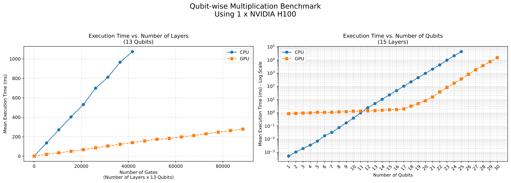

# QLabs

**A Quantum Circuit Composer & Simulator in Mojo** 🔥⚛️

QLabs is a quantum circuit simulation library implemented in Mojo, designed for educational purposes and high-performance quantum circuit simulation.

## 🎓 Educational Purposes

### 🎯 Project Objectives

- **Mojo Implementation**: Re-implement the approach from the referenced paper [1] in Mojo for a Pythonic syntax and enhanced readability.
- **Learning by Doing**: Gain hands-on experience with quantum circuit simulation to understand the capabilities and limitations of classical simulation.
- **Performance & Safety**: Leverage Mojo's strong static typing and compilation for blazing-fast and safe operations.
- **Hardware Acceleration**: Utilize Mojo’s universal GPU programming support to accelerate simulations.

### 🛠️ Implementations

- ✅ **State Vector and Gate Circuit Implementations**
  - Low-level: See `examples/low_level.mojo` using `qlabs.base` tools.
  - High-level: See `examples/circuit_level.mojo` using `qlabs.abstractions` tools.
- ✅ **Partial GPU Support (Cross-Platform: NVIDIA/AMD)**
  - Low-level: See `examples/gpu_low_level.mojo` using `qlabs.base` and `qlabs.base.gpu` tools.
  - High-level: See `examples/circuit_level.mojo` using `qlabs.abstractions` tools.
- ✅ **Quantum States Statistics Calculation**
- ☐ **Qubit Measurements** (Access to the full State Vector is already available, providing even more flexibility)
- ☐ **Continuous Statistics Tracking During Circuit Execution**
- ☐ **Gradient Computations**
- ☐ **Tensor Network Implementation**

[1] This project reimplements and extends the ideas from the following tutorial paper:

> **How to Write a Simulator for Quantum Circuits from Scratch: A Tutorial**  
> *Michael J. McGuffin, Jean-Marc Robert, and Kazuki Ikeda*  
> Published: 2025-06-09 on [arXiv:2506.08142v1](https://arxiv.org/abs/2506.08142v1) (last accessed: 2025-06-12)

### 🔥 Library Performance

Achieves high-speed execution through Mojo's compilation, with up to 100x performance improvement when using GPU acceleration for larger numbers of qubits.



## 🚀 Usage

To get started, you need to install `pixi` to manage project dependencies.

### 📦 Install Pixi

```bash
curl -sSf https://pixi.sh/install.sh | bash
```

### ⚙️ Main Commands

Run the following commands using `pixi run` or `make`:

```bash
pixi run format   # Format the repository's Mojo code with the Mojo formatter
pixi run package  # Compile the qlabs package into a .mojopkg file in build/
pixi run test     # Run all tests in tests/
pixi run main     # Run all example files in examples/
pixi run bench    # Run all benchmarks as defined in benchmarks/main.mojo
pixi run plot     # Run benchmarks and plot their results in data/
```

### 🧑‍💻 Example: Quantum Circuit with `qlabs.abstractions`

```python
from qlabs.base import StateVector, Hadamard, SWAP, NOT, PauliY, PauliZ
from qlabs.abstractions import GateCircuit, StateVectorSimulator, ShowAfterEachGate

num_qubits = 3
qc = GateCircuit(num_qubits)

qc.apply_gates(
    Hadamard(0),
    SWAP(0, 2),
    NOT(1, anti_controls=[2]),
    NOT(0, controls=[1]),
    PauliY(0),
    SWAP(1, 2, controls=[0]),
    PauliZ(1),
)

print("Quantum circuit created:\n", qc)  # Visualization not fully implemented
> Expected output:
> --|H|---x--------|X|--|Y|---*-------
>         |         |         |
> --------|---|X|---*---------x--|Z|--
>         |    |              |
> --------x----o--------------x-------

qsimu = StateVectorSimulator(
    qc,
    initial_state=StateVector.from_bitstring("0" * num_qubits),
    use_gpu_if_available=True,  # GPU support not fully implemented
    verbose=True,
    verbose_step_size=ShowAfterEachGate,  # Options: ShowAfterEachGate, ShowOnlyEnd
)

final_state = qsimu.run()

print("Final quantum state:\n", final_state)
print("Normalised purity of qubit 0 (the top one):", final_state.normalised_purity([0]))
```

## 📄 License

This project is open-source and licensed under the [Apache License 2.0](https://www.apache.org/licenses/LICENSE-2.0). Contributions are welcome!
